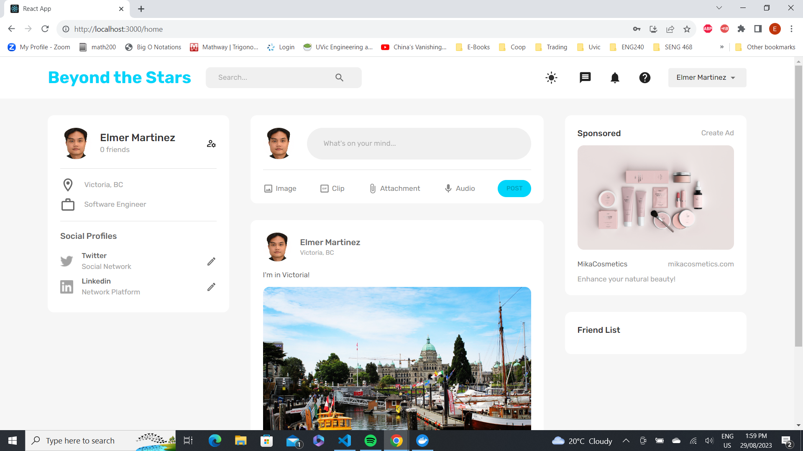
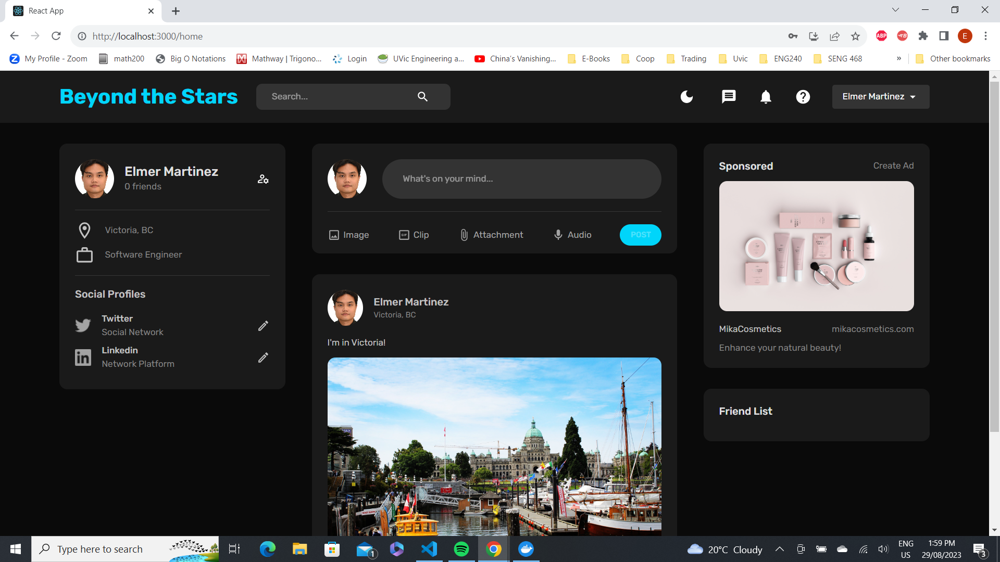
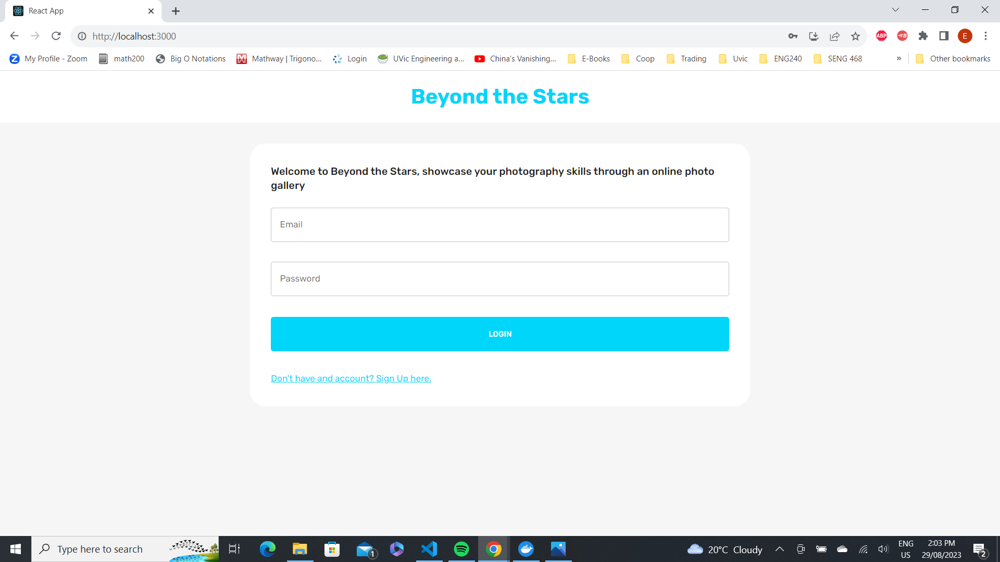
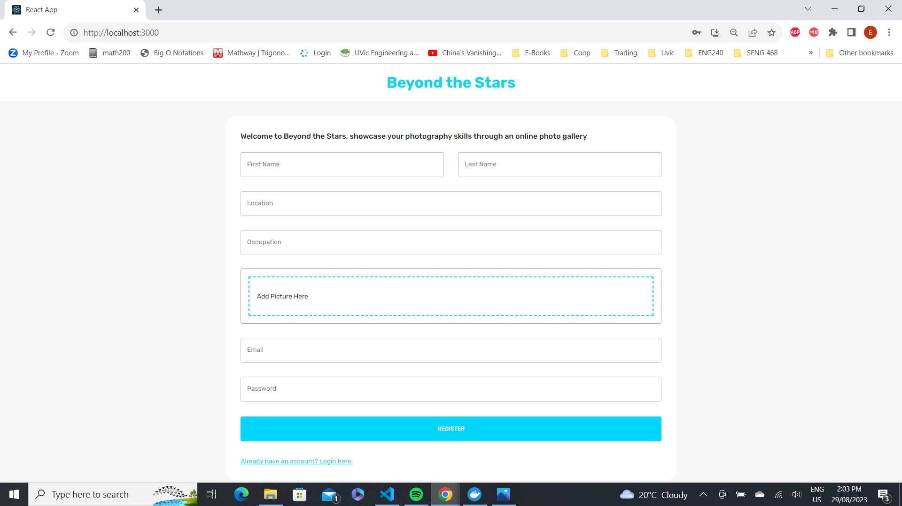
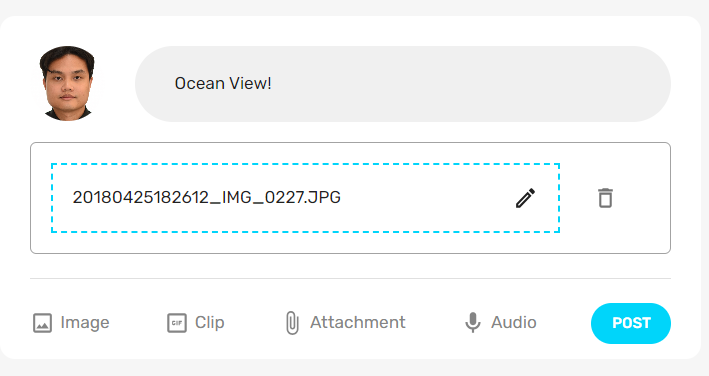
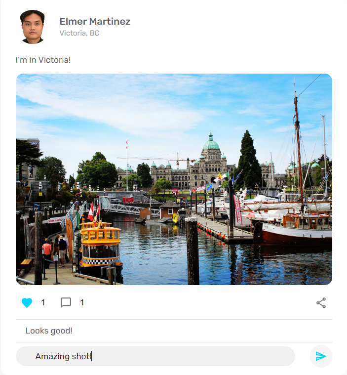

# beyond-the-stars
Beyond the Stars is a social media/online photo gallery for photography enthusiast around the world. 

## Technologies Used:

| Frontend | Backend                                    |
| :------  | :----------------------------------------- |
| ReactJS  | NodeJS                                     |
| ReduxJS  | ExpressJS - server                         |
| CSS      | NGINX - Load Balancer and Reverse Proxy    |
|          | MongoDB - NoSQL Database                   |
|          | Docker - Containerization of Microservices |

## Sample Screenshots from the App

### Light Mode

### Dark Mode

### Login

### Register

### Post Pictures

### Like and Comment 
